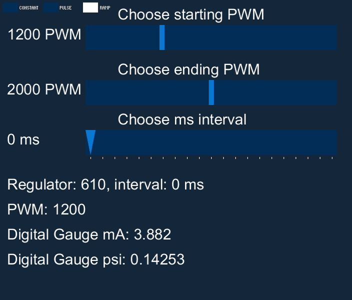
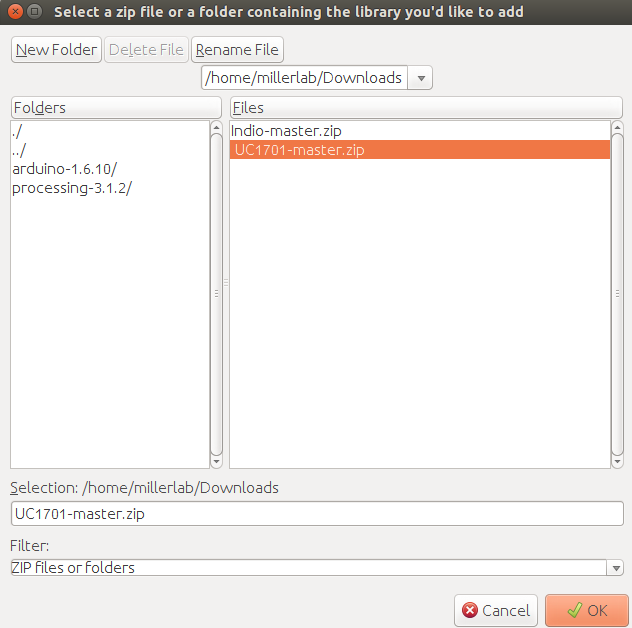
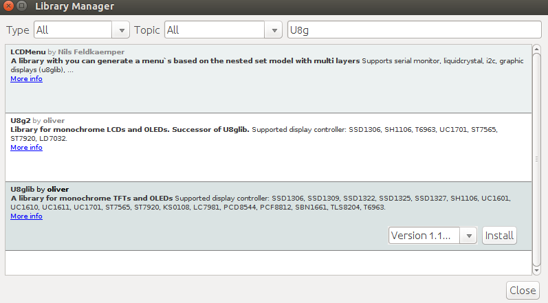

# MillerLab Pneumatic System
## An open-source, Arduino-based Pneumatic system developed at Rice University

#####[Miller Lab: Physiologic Systems Engineering and Advanced Materials Laboratory](http://millerlab.rice.edu)
Developed by Jordan Miller, Bagrat Grigoryan, and Paul Greenfield

Documentation by Nick Calafat and Jordan Miller

## Overview
The MillerLab Pneumatic system is an open-source pneumatic fluid control system for conducting microfluidic experiments, utilizing an [Industruino](http://www.industruino.com/) board and a [Processing](http://www.processing.org/)-based graphical user interface **(GUI)** for controlling the system.

Our typical configuration operates on a 0-30 psi range, but system components can be easily customized. We've also provided a guide to making firmware changes for further customization. Enjoy!

Figure 1. Our recommended configuration consists of a computer running [Processing](http://www.processing.org), connected via USB to the [Industruino](http://www.industruino.com), which is controlling the pneumatics hardware (in this case, an [IP converter](http://www.omega.com/pptst/IP610.html) and a [Digital Pressure Gauge](http://www.omega.com/pptst/DPG1000.html) from [Omega](http://www.omega.com/)). The pneumatics components are conveniently mounted on an [Onstage DIN-rail desktop rack mount](https://on-stage.com/products/view/11185).

Figure 2. The Processing-based graphical user interface to control the pneumatic system.

##Repository Contents
This git repository includes:

1. Current firmware for [Industruino IND.I/O kit](https://industruino.com/shop/product/industruino-ind-i-o-kit-2)
1. Processing GUI to control the Industruino from a computer
1. Wiring diagram for electronics configuration
1. Bill of Materials for all the parts we are using

##Hardware Setup

### Setting up the Pneumatic Device

The complete Bill-of-Materials for this [Industruino](http://www.industruino.com/)-based system are provided in the document `Pneumatic System Bill of Materials` located in this repository. Currently, required items are roughly $500 and the grand total for all recommended items (including the required items) is roughly $1,200. Because [Industruino](http://www.industruino.com/) is DIN-rail mountable, we have included in the recommended items a DIN rail rack desktop mount for flexible configuration, easy wiring, and minimal consumption of desk space.

[Industruino IND.I/O kit](https://industruino.com/shop/product/industruino-ind-i-o-kit-2) can operate anywhere from 6.5-32V DC. We found some great, high precision pneumatics hardware from Omega that operates at 24V. So, we use a 24V power supply to drive the entire rig.

1. Follow the `Pneumatic System Wiring Diagram` and make sure everything is connected properly. It's critical to make sure you have the Analog Input/Output sharing DC ground (`Wire 6` in the wiring diagram). `Wire 3` is optional, for debugging by reading the output from `Analog OUTPUT CH2` with the input from `Analog INPUT CH2`. `Wire 4`, `Wire 5`, and `Wire 7` are only needed if you want to use a digital pressure gauge to validate the actual output pressure is what you expect it to be. Because Industruino can take 4-20 mA inputs, and the digital pressure gauge we selected outputs its reading over 4-20 mA, we can actually use the Industruino itself to read this independent signal and report to the user (via the Processing GUI) the actual measured output pressure.

### Recommended Computer for Controlling the Pneumatics Device
[Arduino](http://www.arduino.cc/), [Industruino](https://industruino.com), and [Processing](http://processing.org/) are all cross-platform hardware and software systems, making them super awesome! **As such, this setup works well with Linux, MacOS, and Windows computer systems.**

To use this equipment you will need a tethered computer and display for live control of the pneumatic system. This could be a computer laptop, or even a very simple and low cost single board computer such as a [Raspberry Pi](https://www.raspberrypi.org/). Setting up and configuring a Raspberry Pi is outside the scope of this README, but if you're interested, we direct you to the [Rice Bioe 421/521 Microcontroller Applications](https://github.com/jmil/Bioe421_521-MicrocontrollerApplications) class; all the labs are available online and Lab 01 gets you going configuring a Raspberry Pi and getting it on the Internet and installing Arduino software.file:///D:/Desktop/MillerLab/Pneumatics%20Github/OpenSourcePneumaticSystem/PicsVids/Linux-PneumaticInstall/BlinkCodeWorks.png

##Software Installation Instructions
###Uploading Firmware to Industruino
1. Download the latest version of Arduino for your OS from [https://www.arduino.cc/en/Main/Software](https://www.arduino.cc/en/Main/Software). 
	**Note: Arduino version 1.6.* or higher is required to communicate with Industruino using the Indio library**
1. Connect Industruino to your computer via USB connection and open Arduino.
	**Linux users: Running Arduino for the first time may result in the prompt pictured below.** Press `Add` to grant permissions to the user account you are using. This allows the account to communicate with Industruino.

	

1. On the Arduino taskbar, navigate to `Tools`->`Board` and select `Arduino Leonardo`. Next, navigate to `Tools`->`Port` and select the port assigned to Industruino.
On Windows, the correct COM port can be determined by locating `Arduino Leonardo` under the `Ports` dropdown in Device Manager. For Mac and Linux operating systems, Arduino Leonardo is listed beginning with `/dev/tty`. The exact port number can be determined using our troubleshooting guide (see below), or you may guess and check (see step 4).
2. We recommend using the blink sketch included in the Arduino software to test the connection to Industruino. To do this, follow `File`->`Examples`->`01.Basics`->`Blink`.
If you have the correct board and port selected, your Industruino display should blink once each second after uploading the blink example sketch. This is a simple way to verify your port selection.

	

1. Next, you will need to install a few libraries used in the PneumaticFirmware sketch, or you may get a missing library error like the one below.

	

	First, download the Indio and UC1701 libraries from the [Industruino Github repository] (https://github.com/Industruino/).
The simplest way to install these libraries is from a ZIP folder, so follow these links to the [UC1701] (https://github.com/Industruino/UC1701) and [Indio] (https://github.com/Industruino/Indio) repositories, then click `Clone or download` -> `Download ZIP` in the top right corner.

	

1. Return to Arduino and navigate to `Sketch`->`Include Library`->`Add .ZIP Library...`. Locate the ZIP folder for either Indio or UC1701 and click `OK`, then repeat this step to install the other library.

	

2. Next we'll install the U8glib library. To do this, navigate to `Sketch`->`Include Library`->`Manage Libraries...`. Locate and install the U8glib library.

	

1. Finally, open `PneumaticFirmware.ino` in Arduino and upload to Industruino using the upload button. If you are successful, Arduino should return the following:

	

###Processing and Libraries Installation
1. Download the latest version of Processing for your OS from [https://processing.org/download/](https://processing.org/download/). Unzip the ZIP folder and move its contents to a desired permanent location (for example, the Documents folder).

1. Connect Industruino to your computer via USB connection.

1. Open `ProcessingGUI` in Processing and run the program. If all libraries are installed, the GUI will open and you can proceed to the next section.
If a library is missing, one of the following errors may occur:

	

1. Libraries can be installed by accessing `Sketch`->`Import Library`->`Add Library` on the Processing Taskbar. From this list, find and install the missing libraries. Libraries will automatically install to the Processing sketchbook.

	

1. Once all the libraries are installed, try to run the GUI again.

###GUI Overview
The Processing GUI (depicted below) allows the user to specify settings for a pneumatic program. 
The three buttons in the top left corner of the GUI change the behavior of the pneumatic program. Specifically, the system can be programmed to provide a constant PWM, a pulsing PWM between two specified values, or a ramping PWM between two specified values. These behaviors can also be selected by pressing keys 1, 2, or 3 (corresponding to constant, pulse, and ramp, respectively).

The large sliders on the GUI allow the user to specify the starting PWM (for constant, pulse and ramp), the ending PWM (for pulse and ramp), and the ms time interval (for pulse and ramp).

Beneath the sliders, numeric indicators display current program settings and system outputs.

###Starting and Understanding a Pneumatics Program
1. Connect Industruino to computer via USB

1. Open `ProcessingGUI` in Processing

1. Run the ProcessingGUI in Processing. If the GUI launches, you are nearly there! If, instead, a port error occurs, you can follow our troubleshooting guide (see below).

1.	**USAGE NOTE: We use PWM values on the GUI sliders, a purposeful stylistic choice by us.** Using PWM values (from 0-4096) provide the highest possible resolution to controlling the Industruino. You can learn more from the Industruino default programs that come with their sample firmware. Additionally, since users might want to use different pneumatics equipment than what we have selected (notably, with a different psi range than what we are using), using PWM values in the GUI provides the most flexibility for end users. You will have to calibrate they system yourself if you use a pneumatics system different from our recommendation. **We use Industruino in `mA` mode, which maps 0-4096 PWM to 0-20 mA**, and [our recommended IP converter](http://www.omega.com/pptst/IP610.html) takes 4-20 mA signal and outputs 0-30 psi of gas pressure.

1. Specify the desired pneumatic settings by adjusting the sliders under `Choose starting PWM` and `Choose ending PWM` and press `<Enter>` on the keyboard to run the program. You can alternatively run a custom program with a pre-programmed keypress (see Configuration for instructions on creating a custom program).

	**SAFETY NOTE: For safety with pneumatics systems (and to protect pneumatics hardware from high frequency oscillations), the air pressure is not changed "live". Instead, the user should set the desired PWM, then press the `<Enter>` key to send values to the pneumatics system**

1. Press `0` on the keyboard to stop the program and reset all values to `0`.

The default `ProcessingGUI` has the following THREE MODES:

	key		Result
	1		Activate CONSTANT mode
	2		Activate PULSE mode
	3		Activate RAMP mode
	0		Turn off all pneumatics (set them to 0) and go back to CONSTANT mode
	
CONSTANT Mode
Uses the Starting PWM setting, and keeps the pneumatics at that CONSTANT value.

PULSE Mode
This mode oscillates between the Starting and Ending PWM values, with the `ms interval` setting as the delay between each switch, in milliseconds.

RAMP Mode
This mode steadily ramps PWM between the Starting and Ending PWM values, with the `ms interval` as the delay between steps. The default Arduino firmware has set the stepsize to be 10 PWM units, but you can change this in the Arduino firmware to be less or more depending on your needs.

Figure 3. Demonstration of the three pneumatic modes described above.

###Troubleshooting: Use `CheckSerialPort.pde` to Determine Port Number

**NOTE: As detailed above, this equipment is compatible with Linux, Mac, and Windows systems because Arduino, Industruino, and Processing are compatible with those systems. This section is split into instructions based on operating system, as each has a different method of naming and assigning serial ports. Please refer to the instructions for the OS you are using.**

####On Windows:

1. Connect Industruino to the desired USB port on your computer
1. Open Device Manager and navigate to the `Ports(COM & LPT)` dropdown. Find `Arduino Leonardo` and take note of its assigned COM number
  
	

1. Next, open `CheckSerialPort.pde` in Processing and run the program. Active COM ports will be listed, along with their indices in the ports list. Locate the COM port that Industruino is connected to (determined in step 2), and take note of its index.

   

1. Open ProcessingGUI and navigate to the following line:
	
		String portName = Serial.list()[0]; //change the 0 to a 1 or 2 etc. to match your port

	Change the bracketed number to the index noted in step 3 (in the example images shown, the correct index is [0]). These steps can be repeated to troubleshoot any port connectivity issues, as the COM number assigned to Industruino could depend on the USB port used and other connected devices

####On MacOS:

1. Connect Industruino to the desired USB port on your computer
2. Open `System Information` and navigate to the `USB` category under `Hardware`. `System Information` can usually be found in the `Utilities` folder within `Applications`. It can also be found by accessing the Apple icon toolbar in the top left corner, then navigating to `About This Mac`->`System Report`. Locate Arduino Leonardo and take note of its Location ID.

	

3. Next, open `CheckSerialPort.pde` in Processing and run the program. Active USB connections will be listed, along with their indices in the ports list. Industruino will be listed as `/dev/tty.usbmodemxxx`, where `xxx` is numbers corresponding with Industruino's Location ID, noted in step (2). Take note of the index associated with this device.

	

4. Open ProcessingGUI and navigate to the following line:
	
		String portName = Serial.list()[0]; //change the 0 to a 1 or 2 etc. to match your port

	Change the bracketed number to the index noted in step 3 (in the example images shown, the correct index is [3]). These steps can be repeated to troubleshoot any port connectivity issues, as the Location ID assigned to Industruino could depend on the USB port used and other connected devices
    
####On Linux:

1. Connect Industruino to the desired USB port on your computer
2. Open the Linux command line and type the command `dmesg | grep tty`. This will create a list of devices connected via serial ports. In our case, Industruino is the device named `ttyACM0`.

	

2. Next, open `CheckSerialPort.pde` in Processing and run the program. Active USB connections will be listed, along with their indices in the ports list. Our Industruino is listed as `/dev/ttyACM0`. Take note of the index associated with this device.

	
3. Open ProcessingGUI and navigate to the following line:
	
		String portName = Serial.list()[0]; //change the 0 to a 1 or 2 etc. to match your port

	Change the bracketed number to the index noted in step 3 (in the example images shown, the correct index is [0]). These steps can be repeated to troubleshoot any port connectivity issues, as the name and index assigned to Industruino could depend on the USB port used and other connected devices.
    
##More Configuration Options and Examples
###I want to:
####Change the ramp step size: edit Industruino firmware
Ramp step size controls the integral interval for PWM steps at each time interval.
For example, in the GUI configuration shown above we have a 1000ms interval set, and the default ramp step size is 10. This means there will be a 10 PWM change every 1000ms. Edit the following firmware line to change the PWM step size used in ramp mode:
	
    int stepSize = 10; // in mA_raw, How many steps should we take? From 0-4095

  
####Customize the Processing interface
The resolution on the PWM slider is autoscaled based on the range of PWM available and the size of the GUI window. Thus, if you want greater control precision using your mouse for a certain project, you can restrict the PWM slider to the range you're working in. For instance, changing `min_PWM` to `1000` and `max_PWM` to `2000` would increase the precision of the PWM slider scale in the Processing GUI. The interval line sets the default ms time interval.

	int min_PWM = 0;
	int max_PWM = 3995;
	int interval = 1000;
    
    
####Create a custom pneumatic program
Processing can easily take keyboard input, so we have a section of the `ProcessingGUI` code that allows for custom setup of reproducible pneumatic programs simply by pressing the keyboard key of your choice.

The relevant section of the `ProcessingGUI` code begins:

	void keyPressed() {
	  switch(key) {
	    case('1'):
	      modeSelected.activate(0);
	      break;
	    case('2'):
	      modeSelected.activate(1);
	      break;
	    case('3'):
	      modeSelected.activate(2);
	      break;
	    ...
	    
This section tells Processing to "listen" for keyboard strikes, and to run the following code afterwards. So, if the user presses the `1` key, the modeSelected will be `0`. Recall from above: `modeSelected = 0` corresponds to the `CONSTANT` pneumatic mode where the "starting PWM" value from the GUI is used.

A custom program on a unique keypress can be made simply by adding to this `switch` in the code. The syntax you must have is:

	case('x'):
		// Set some values here
	   break;

Where **'x'** is the keyboard key you want to activate your program. As another example, study this next bit of code carefully and you will hopefully see how pressing the `0` key is able to programmatically shut off all pneumatics and go back to CONSTANT mode:

    case('0'):
      min.setValue(0);
      max.setValue(0);
      interval = 0;
      modeSelected.activate(0);
      break;

**A more sophisticated example:** Here, we demonstrate a pneumatic program that ramps from `1300` to `2100` PWM at a `0`ms interval in continuous RAMP mode. We also synchronized the beginning of the program with an audible tone being played (`tone.wav`). Note that `tone.wav` is set in the `setup()` section with:

	  // PREPARE WAV FILE TO BE PLAYED
	  minim = new Minim(this);
	 
	  // this loads mysong.wav from the data folder
	  song = minim.loadFile("tone.wav");

The desired custom program can therefore be activated when pressing the `5` key with this added `case`:

    case('5'):			//specifies the numeric key that initiates the program (pressing 5 sets the following parameters)
      //Using minim library to simply play the wav file:
      song.play(); 				// play the tone.wav file in the current directory
      song.rewind(); 			// "rewind" it so it can be played again
      min.setValue(1300);		//specifies the starting PWM
      max.setValue(2100);		//specifies the ending PWM
      interval = 0;				//specifies the time interval (in ms)
      modeSelected.activate(2);	// specifies the pneumatic behavior (0 = constant, 1 = pulse, 2 = ramp)
      break;

##Acknowledgements
- Thanks to [Arduino](https://www.arduino.cc) and [Processing](https://processing.org) for the open-source software that enabled us to build our pneumatic system
- Thanks to [Industruino](https://industruino.com) for designing the Industruino board, and for their detailed help files and general tech support we relied on to develop this system.

