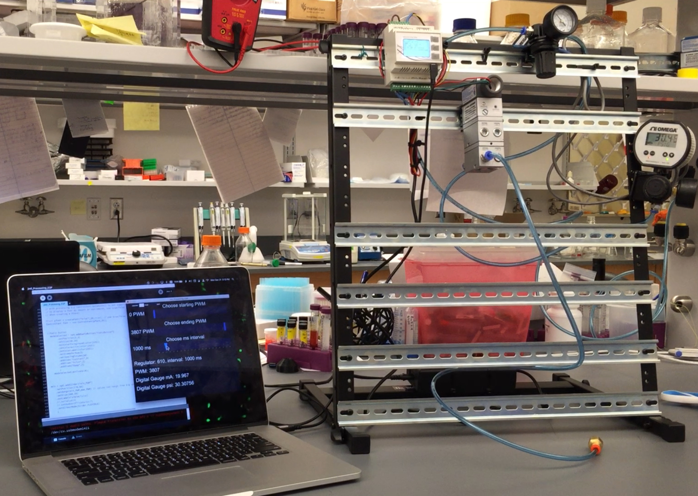

# MillerLab Pneumatic System

##### An open-source Arduino-based Pneumatic system developed at Rice University
##### Miller Lab: Physiologic Systems Engineering and Advanced Materials
##### [millerlab.rice.edu] (http://millerlab.rice.edu)

### Overview

 Coming soon...

###Build Documentation
This git repository includes:
- Current firmware for Industruino IND.I/O kit
- Processing GUI to control the Industruino from a computer
- Wiring diagram for electronics configuration
- Bill of Materials for all parts we are using

###Installation Instructions
#####Uploading Firmware to Industruino
1. Download the latest version of Arduino from https://www.arduino.cc/en/Main/Software
2. Connect Industruino to computer via USB connection
3. Open PneumaticFirmware in Arduino
4. Under "Tools," select Board: "Arduino Leonardo". In "Tools," navigate to Port; select the COM port Industruino is connected to.
This can be determined by locating "Arduino Leonardo" under the "Ports" dropdown in Device Manager.
5. Finally, upload the firmware to Industruino using the upload button in Arduino

#####Processing Installation
1. Download the latest version of Processing from https://processing.org/download/
2. Connect Industruino to computer via USB connection
3. Open "ProcessingGUI" in Processing
4. Click the run button on Processing, then install ControlP5, minim, and sound libraries if prompted
5. ... (more thorough instructions coming soon)

#####Starting a Pneumatic Program:
1. Open ProcessingGUI in Processing
2. Connect Industruino to computer via USB
3. Run the ProcessingGUI in Processing. If a port error occurs, you can follow our troubleshooting guide (see below)
4. Specify the desired pneumatic settings and press Enter to run the program, or run your custom program (see Configuration for instructions on creating a custom program)
5. Press 0 to stop the program

#####Using CheckSerialPort to Determine Port Number
1. Connect Industruino to the desired USB port on your computer
2. Open Device Manager and navigate to the Ports(COM & LPT) dropdown. Find "Arduino Leonardo" and take note of its assigned COM number

3. Next, open "CheckSerialPort" in Processing and run the program. Active COM ports will be listed, along with their indices in the ports list.
Locate the COM port that Industruino is connected to (determined in step 2), and take note of its index.

4. Open ProcessingGUI and navigate to line 90. Change the bracketed number to the index noted in step 3.
These steps can be repeated to troubleshoot any port connectivity issues, as the COM number assigned to Industruino 
will be based on USB port used and other connected devices

###Configuration
 Coming soon...

####I want to:
######Change the ramp step size

######Reconfigure the Processing interface

######Create a custom pneumatic program

###Acknowledgements

