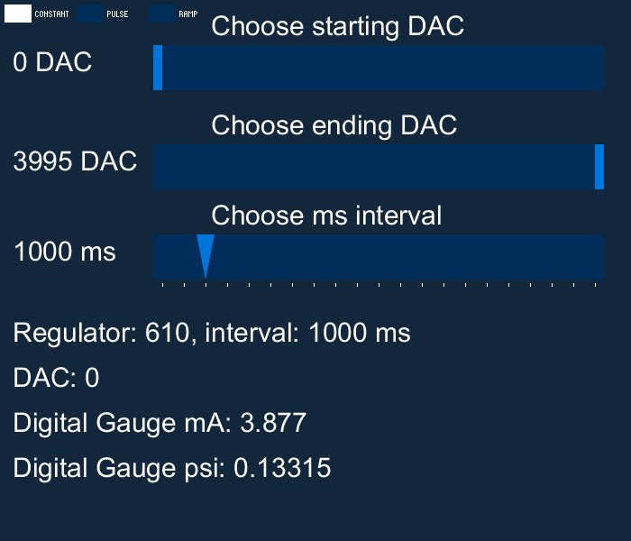
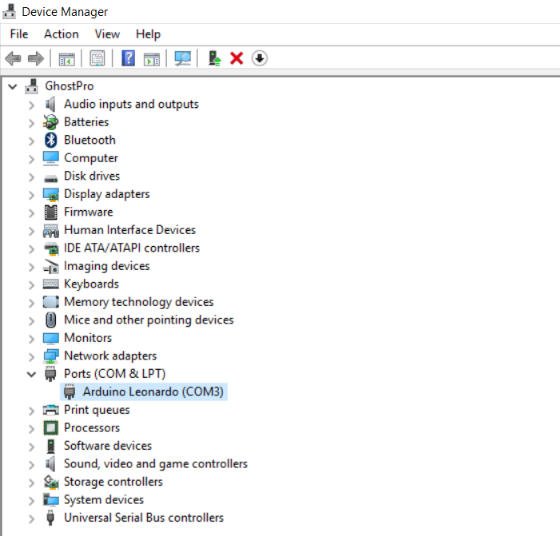

# MillerLab Pneumatic System
##### An open-source, Arduino-based Pneumatic system developed at Rice University

##### Miller Lab: Physiologic Systems Engineering and Advanced Materials
##### [millerlab.rice.edu] (http://millerlab.rice.edu)
##### Developed by Jordan Miller, Bagrat Grigoryan, Paul Greenfield and Nick Calafat
##### Documentation by Nick Calafat

### Overview
The MillerLab Pneumatic system is an open-source pneumatic fluid control system for conducting microfluidic experiments, utilizing an Industruino board and a Processing-based GUI for controlling the system.
Our specific setup operates on a 0-30psi range, but system components can be easily customized. We've also provided a guide to making firmware changes for further customization. Enjoy!

###Build Documentation
This git repository includes:
- Current firmware for Industruino IND.I/O kit
- Processing GUI to control the Industruino from a computer
- Wiring diagram for electronics configuration
- Bill of Materials for all parts we are using

###Installation Instructions
#####Uploading Firmware to Industruino
1. Download the latest version of Arduino from https://www.arduino.cc/en/Main/Software
2. Connect Industruino to computer via USB connection
3. Open PneumaticFirmware in Arduino
4. On the Arduino taskbar, navigate to Tools>Board and select "Arduino Leonardo". Next, navigate to Tools>Port and select the COM port assigned to Industruino.
   The correct COM port can be determined by locating "Arduino Leonardo" under the "Ports" dropdown in Device Manager
5. Finally, upload the firmware to Industruino using the upload button in Arduino

#####Processing and Libraries Installation
1. Download the latest version of Processing from https://processing.org/download/
2. Connect Industruino to computer via USB connection
3. Open "ProcessingGUI" in Processing and run the program. If all libraries are installed, the GUI will open and you can proceed to the next section.
   If libraries are missing, one of the following errors may occur:

4. Libraries can be installed by accessing Sketch>Import Library>Add Library on the Processing Taskbar. Find the missing libraries and press install. 
   Libraries will automatically install to the Processing sketchbook

#####Starting a Pneumatic Program
1. Open ProcessingGUI in Processing
2. Connect Industruino to computer via USB
3. Run the ProcessingGUI in Processing. If a port error occurs, you can follow our troubleshooting guide (see below)
4. Specify the desired pneumatic settings and press Enter to run the program, or run your custom program (see Configuration for instructions on creating a custom program)
5. Press 0 to stop the program

#####Using CheckSerialPort to Determine Port Number
1. Connect Industruino to the desired USB port on your computer
2. Open Device Manager and navigate to the Ports(COM & LPT) dropdown. Find "Arduino Leonardo" and take note of its assigned COM number
   
3. Next, open "CheckSerialPort" in Processing and run the program. Active COM ports will be listed, along with their indices in the ports list.
   Locate the COM port that Industruino is connected to (determined in step 2), and take note of its index
   
4. Open ProcessingGUI and navigate to line 90. Change the bracketed number to the index noted in step 3.
   These steps can be repeated to troubleshoot any port connectivity issues, as the COM number assigned to Industruino will depend on USB port used and other connected devices

###Configuration
 Coming soon...

####I want to:
######Change the ramp step size

######Reconfigure the Processing interface

######Create a custom pneumatic program

###Acknowledgements
- Thanks to [Arduino] (https://www.arduino.cc) and [Processing] (https://processing.org) for the open-source software that enabled us to build our pneumatic system
- Thanks to [Industruino] (https://industruino.com) for providing the industrial board for controlling our system
